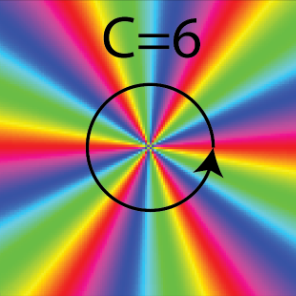
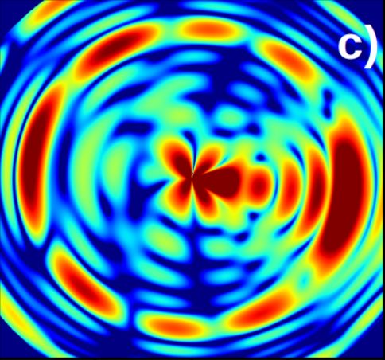
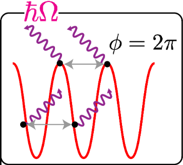
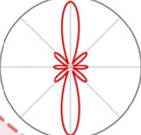
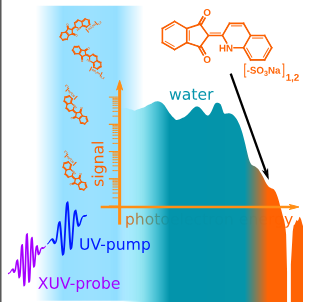
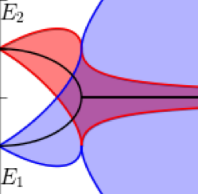
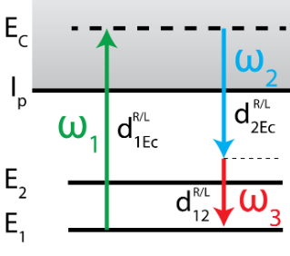
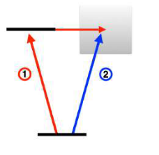
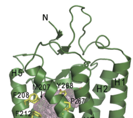
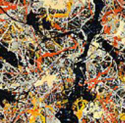

Here you can find a list of my publications, including preprints and thesis.
See also my [Google Scholar](https://scholar.google.com/citations?user=9EZ2fK4AAAAJ&hl=en) page.

# Journal publications

{: style="float: left; margin-right: 5px"} <small>***Chiral topological light for detection of robust enantiosensitive observables***</small>\
<small>**N. Mayer**, D. Ayuso, P. Decleva, M. Khokhlova, E. Pisanty, M. Ivanov and O. Smirnova</small>\
<small>*Nature Photonics*, 2024</small>\
<small>[doi:10.1038/s41566-024-01499-8](https://doi.org/10.1038/s41566-024-01499-8)</small>  <small>[arXiv:2303.10932](https://arxiv.org/abs/2303.10932)</small>

{: style="float: left; margin-right: 5px"} <small>***Imprinting chirality on atoms using synthetic chiral light fields***</small>\
<small>**N. Mayer**, S. Patchkovskii, F. Morales, M. Ivanov and O. Smirnova</small>\
<small>Physical Review Letters, 2022</small>\
<small>[doi:10.1038/s41566-024-01499-8](https://doi.org/10.1038/s41566-024-01499-8)</small> 
<small>[arXiv:2112.02658](https://arxiv.org/abs/2112.02658)</small>

{: style="float: left; margin-right: 5px"} <small>***Role of spin-orbit coupling in high-order harmonic generation revealed by supercycle Rydberg trajectories***</small>\
<small>**N. Mayer**, S. Beaulieu, et al.</small>\
<small>Physical Review Letters, 2022</small>\
<small>[doi:10.1103/PhysRevLett.129.173202](https://doi.org/10.1103/PhysRevLett.129.173202)</small> 
<small>[arXiv:2112.02981](https://arxiv.org/abs/2112.02981)</small>

{: style="float: left; margin-right: 5px"} <small>***Population transfer to high-angular momentum states in infrared-assisted XUV photoionization of helium***</small>\
<small>**N. Mayer**, P. Peng, D.M. Villeneuve, S. Patchkovskii, M. Ivanov, O. Kornilov, M.JJ. Vrakking and H. Niikura</small>\
<small>Journal of Physics B: At. Mol. Opt. Phys., 2020</small>\
<small>[doi:10.1088/1361-6455/ab9495](https://doi.org/10.1088/1361-6455/ab9495)</small>

{: style="float: left; margin-right: 5px"} <small>***Femtosecond extreme ultraviolet photoelectron spectroscopy of organic molecules in aqueous solution***</small>\
<small>J. Hummert, G. Reitsma, **N. Mayer**, E. Ikonnikov, M. Eckstein, O. Kornilov</small>\
<small>The Journal of Physical Chemistry Letters, 2018</small>\
<small>[doi:10.1021/acs.jpclett.8b02937](https://doi.org/10.1021/acs.jpclett.8b02937)</small>

{: style="float: left; margin-right: 5px"} <small>***Interference stabilization of autoionizing states in molecular N2 studied by time- and angular-resolved photoelectron spectroscopy***</small>\
<small>M. Eckstein, **N. Mayer**, C.-H. Yang, G. Sansone, M. JJ. Vrakking, M. Ivanov and O. Kornilov</small>\
<small>Faraday Discussions, 2016</small>\
<small>[doi:10.1039/C6FD00093B](https://doi.org/10.1039/C6FD00093B)</small> 
<small>[arXiv:1605.02632](https://arxiv.org/abs/1605.02632)</small>

# Preprints

{: style="float: left; margin-right: 5px"} <small>***Enantiosensitive exceptional points***</small>\
<small>**N. Mayer**, N. Moiseyev and O. Smirnova</small>\
<small>[*arXiv:2306.12293*](https://arxiv.org/abs/2306.12293), 2023</small>

# Thesis

{: style="float: left; margin-right: 5px"} <small>***Ultrafast spectroscopy and control of quantum dynamics in tailored multicolor laser fields***</small>\
<small>**N. Mayer**</small>\
<small>Supervisor: Prof. Misha Ivanov</small>\
<small>PhD thesis, Humboldt-Universität zu Berlin, 2023</small>\
<small>[doi:10.18452/28371](https://doi.org/10.18452/28371)</small>

{: style="float: left; margin-right: 5px"} <small>***Interference stabilization of complex molecular Fano resonances***</small>\
<small>**N. Mayer**</small>\
<small>Supervisors: Prof. Misha Ivanov and Dr. Oleg Kornilov</small>\
<small>MSc thesis, Humboldt-Universität zu Berlin, 2017</small>\
<small>[See the pdf](../files/Thesis_MSc.pdf)</small>

{: style="float: left; margin-right: 5px"} <small>***Studio della dinamica ultraveloce vibrazionale del cromoforo retinale e del suo contra-ione in fase liquida***</small>\
<small>**N. Mayer**</small>\
<small>Supervisors: Prof. Fulvio Parmigiani and Dr. Goran Zgrablić</small>\
<small>B.Sc. thesis, Università degli studi di Trieste, 2015</small>\
<small>[See the pdf](../files/Thesis_BSc.pdf)</small>

{: style="float: left; margin-right: 5px"} <small>***La meccanica quantistica e la fine del determinismo***</small>\
<small>**N. Mayer**</small>\
<small>Highschool thesis, Liceo Leopardi-Majorana, 2011</small>\
<small>[See the pdf](../files/Thesis_HS.pdf)</small>
